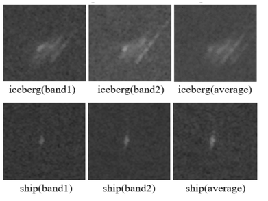

# Iceberg or Not Iceberg? 
A Traditional vs. Convolutional Neural Network Image Classification Problem
By Xu Cao, Thomas Guo, and Louise Lai

## Paper Link
See full paper here: https://docs.google.com/document/d/1yvszY0MhvLaHDs6TdiBjB2FXW5RD-X8SwVEd8hGgUnA/edit?usp=sharing

## I. Abstract
Our project was to build an binary image classifier that is able to classify between icebergs and ships. The data was pulled from Kaggle. Employing the CRISP-DM model, we went through the following phases: Business Understanding, Data Understanding, Data Preparation, Modeling, and Evaluation. 

We tested three different types of models: shallow classifiers, shallow classifiers with feature extraction, and deep learning with convolutional neural networks. 

Our models had accuracies of 73.26%, 76.50%, and 84.30% respectively.

## II. Project Description
 
Our project was taken from kaggle.com: https://www.kaggle.com/c/statoil-iceberg-classifier-challenge/data 

The task of the project is to classify the given data into two classes: iceberg or ship. Because the data contains quasi-images, we treat it as an image classification problem.

## III. Business Understanding

This Kaggle competition was proposed by Statoil, an international oil company that operates ships around the globe. In particular, they are concerned about their ships off the East Coast of Canada. There are many drifting icebergs that pose a threat to these ships.

If we can detect if these objects in the ocean are icebergs or ships using satellite data, we can greatly aid in the navigation of these ships by alerting them of potential icebergs.

## IV. Data Understanding

### A. Introduction
Kaggle provides us with all the data that we need, so there was no need to collect data. The following is a brief summary of our data.

Target Variable:
is_iceberg: This indicates the object’s class. A value of 1 indicates that the object is an iceberg and a value of 0 indicates that the object is a ship.

Features:
id: This is the unique identification number of the image.
band_1: The actual satellite data. 75x75 pixel values presented as a list of 5625 floats. 
band_2: Similar to band_1, but a different polarization, which we explain later.
inc_angle: Incidence angle from which the image was taken.

We had a total of 1604 data points in the training set, with 753 being icebergs and 851 being ships.

### B. Further Exploration of band_1 and band_2
The Kaggle competition provided an unclear description of the features band_1 and band_2 so we did further research. band_1 corresponds to an HH polarization while band_2 corresponds to an HV polarization from the satellite.

What does this mean? The satellite detects objects on earth by sending out electromagnetic waves. These electromagnetic waves can be polarized, which changes the direction of the waves’ electric field. For example, if the radiation is vertically polarized, the electromagnetic wave oscillates vertically. HV(transmit/receive horizontally) means the waves being sent out are horizontally polarized and the reflecting waves are vertically polarized. HH is a type of co-polarized signal, which means waves are transmitted and received in the same way. Co-polarized signals are usually strong. HV is a type of cross-polarized signal, which means the polarization of received waves is perpendicular to the polarization of transmit waves. Cross-polarized signals are usually weak but they are useful when multiple scattering (radiation is scattered by multiple localized scattering centers) occurs.

What we learned from exploring the actual science behind these features is that both band_1 and band_2 are important and that they can be linearly independent. Thus, both features might be helpful for whatever model we build.

Next, we wanted to understand how this is an image classification problem. After all, these satellites are sending out electromagnetic waves, not taking images. We learned that the satellite will send out electromagnetic waves to an area and convert the waves it receives into decibel units. These values represent a 2D scan of the surface. Thus, each value represents a pixel—not an RGB pixel but a decibel pixel of a 2D electromagnetic reading. This 75x75 matrix of pixels is then flattened into an array of length 5,625. So we can still view band_1 and band_2 as images, just not our usual RGB interpretation of an image.

An example band_1 looks like this: [-27.878361, -27.15416, -28.668615, -29.537971, -29.092485…]

This is extremely hard to visualize or understand. While band_1 and band_2 are not traditional images, we predicted that we could understand the data better if we converted them to traditional images. To do  this, we first ran code to find the minimum and maximum values contained in band_1 and band_2 arrays across all 1604 data points in the training set. The code that does this is called exploreBands.js. 

We found that all float values occurred between -50 and 50. We converted these float values to values between 0 and 255 by doing the following: Y = (X + 50) * 255 / 100, where X is a value in the band and Y is the new value between 0 and 255. This code is called transformFloats.js. We then took these values and created RGB pixels by converting Y to (Y, Y, Y), where Y indicates the red, green, and blue values of the pixel. When all values of an RGB pixel are the same, this produces a “gray” pixel. Thus the images we create from this 75x75 matrix of RGB values are black and white. The code that converts these values to RGB and produces images from them is called Image.java.

We created an image for each band as well as an image of the bands combined together. This is just one example of the thousands of images we were able to create:

These images helped us to visualize the very abstract data given to us in decibels and to glean key insight from the dataset.

### C. Further Exploration of inc_angle
As mentioned previously, inc_angle is the incidence angle from which the image was taken.

We took the same scientific approach and found that the incidence angle is the angle between the incident radar beam and the direction perpendicular to the surface. A large or a small incidence angle doesn’t mean a picture with better quality.

Visualizing the counts of each incidence angle reveals trends in the data. This chart was created in R and counts the number of photos that have a particular incidence angle. Insights include:
Over one-tenth of all images are captured at an angle of 43° (181/1604  = 11.3%)
There are no images captured at an incidence angle greater than 46°
Excluding outliers, virtually all images are captured within a ten degree window starting from 35° and ending at 45° (1591/1604  = 99.2%)

## V. Data Preparation

### A. Feature Extraction: Texture
Through our research, we discovered that feature extraction can make image classifiers better. So one step in our data preparation phase was to extract a feature representing texture from the images.

Our work is based off of a research paper we found on IEEE: ieeexplore.ieee.org/document/4309314/. However, all the code we wrote was original. Below, we discuss the steps we took to extract the texture feature. The code is called ImageToTexture.java.

First, for each image we construct a gray-tone spatial-dependence matrix using the averaged pixel values of the two bands. The gray-tone spatial-dependence matrix keeps track of how often pixels of certain gray-tone values appear next to each other. Let’s say row 10 and column 113 in the gray-tone spatial-dependence matrix contains a value of 5. This means that a pixel of gray-tone value 10 and a pixel of gray-tone value 113 appear next to each other in the image 5 times. Below is an example of a gray-tone spatial-dependence matrix.

Second, using the gray-tone spatial-dependence matrix, we take the sum of the square of all values in the matrix and then divide that by the size of the matrix. This give us a value called Angular Second Moment, which measures how homogeneous the image is. The intuition behind this is that the more homogenous your image is, the larger numbers you’ll get in your gray-tone spatial-dependence matrix. This means a higher Angular Second Moment value.

We then took Angular Second Moment and used it as a feature in our dataset.

### B. Converting JSON to CSV
Our data was provided in a JSON format, which we converted to CSV for easier use. For example, band_1 was given in an array format. We split each value of band_1 into its own column in the CSV. This meant that each pixel was a feature. We also took the texture feature we computed in the previous part and added it to this csv file. The code that does this is called convertToCSV.js.

## VI. Modeling

### A. Introduction
Our approach to this problem was educational. We did not want to spend all of our time optimizing one model. Instead, we wanted to explore a variety of models and compare them. We used a paper by Yann LeCun, Geoffrey Hinton, and Yoshua Bengio to learn more about the different models available for image classification: https://www.researchgate.net/publication/277411157_Deep_Learning. 

We learned that the traditional approach to image classification was using shallow classifiers on top of feature extraction. The new approach is using Convolutional Neural Networks. Thus, we narrowed down our approach to three different types of models: shallow classifiers, shallow classifiers with feature extraction, and deep learning.

We first compared using and not using feature extraction with shallow classifiers. We learned that in cases where the differences in image are very abstract, feature extraction is necessary. In the following pictures of an apple and banana, a shallow classifier would work well without feature extraction because the differences are not abstract. Major differences in shape and color can easily be detected without feature extraction.

However, in the following picture of a wolf and a dog that looks like a wolf, it is clear that we need feature extraction. Similarities can be very abstract: for example, a classifier needs to recognize that a wolf standing up is the same as a wolf sitting down. Differences are also very abstract. The color and shape of these two species are very similar. Differences lie in how the ears are shaped and how the mouth is shaped. However, using feature extraction, it is possible to extract a feature that highlights these differences and makes the shallow classifier’s job easier.

We then compared shallow classifiers and deep learning with convolutional neural networks. We learned that shallow classifiers require a lot of domain knowledge and human time. Deep learning on the other hand does not need domain knowledge since the neural network learns features by itself. However, it does take a lot computational power and computer time. This is becoming less and less of a concern as computing power becomes cheaper. Finally, we learned that convolutional neural networks generally provide the best results for image classification.

### B. Shallow Classifiers
We prototyped models in RapidMiner using two shallow classifiers: Naive Bayes and K-NN. The top level process looks like this:

Inside the Cross Validation operator for Naive Bayes looks like this:

And for K-NN, it looks like this:

Results for Naive Bayes: 64.58% Accuracy

Results for K-NN: 73.26% Accuracy

As you can see, K-NN proved to be the better shallow classifier for this problem.

### C. Shallow Classifiers with Feature Extraction
We then used the same shallow classifiers on the updated dataset with the added texture feature, Angular Second Moment, which we extracted previously. The RapidMiner processes look exactly the same. The only difference is that the data includes an extra feature.

Results for Naive Bayes: 64.58% Accuracy

Results for K-NN: 76.50% Accuracy

As you can see, the added feature did not improve the Naive Bayes model but actually improved the K-NN model by a significant amount. This shows that feature extraction can help shallow classifiers.

### D. Deep Learning with Convolutional Neural Networks
This section provides an overview of the CNN algorithm used.
Convolutional Neural Networks (CNNs) are a form of neural networks that are proven to be highly effective in solving image classification problems. There are four main steps in a CNN, as illustrated below:

Image source: clarifai.com

Step 1: Convolution
Step 2: Non linearity
Step 3. Pooling
Step 4. Fully Connected Layer

The model used each step to build the CNN, with detailed explanations in the code itself.

Optimizations
The code was optimized on two things:
Which image band to use?
As mentioned above, there are two bands that are used to represent the same image. We tried using just band_1, just band_2, and finally, and average of band_1 and band_2. Ultimately, just using band_2 achieved nearly 8% increase in validation accuracy (i.e. predictive accuracy on images the model has not seen yet).
How many batch sizes / epochs?
Epochs are the number of times and entire dataset is shown the the CNN. Batch sizes are the number of data points the model parses at one time. So, for example, if you have 1000 data points and a batch size of 250, it will take 4 iterations to complete one epoch. After testing ranges of epochs and batch sizes, we found that a batch size of 32 and epoch of 12 was the most optimal, resulting in an validation accuracy of 84%.

## VII. Evaluation

We can evaluate our models with various metrics such as precision, recall, or speed. For this problem, we decided to use accuracy, which we believe gives a good representation of performance in situations where you have binary classification and the dataset is split relatively evenly between the two classes.

Summary of our results:
K-NN: 73.26%
K-NN with F.E.: 76.50%
Deep Learning with C.N.N.: 84.30%

Our results reflected our research. Feature extraction did indeed improve the performance of our shallow classifier and convolutional neural networks did outperform shallow classifiers.

## VIII. Conclusion

### A. Following the CRISP-DM Model
We tried to structure our project to match what is used in industry. Thus, we followed all phases of the CRISP-DM Model, except the last one, deployment.

Business Understanding:
We understood how classifying icebergs and ships would help maritime navigation.

Data Understanding:
We understood the science behind our data. Then we were able to visualize various features, which helped us frame the problem as an image classification problem and decide on which models to use.

Data Preparation:
We converted the dataset to CSV format and extracted a texture feature.

Modeling:
We experimented with 3 different types of models: shallow classifiers, shallow classifiers with feature extraction, and deep learning with convolutional neural networks.

Evaluation:
We evaluated our models using accuracy and found that convolutional neural networks worked best, with an accuracy of 84.30%, which our other two models had accuracies of 73.26% and 76.50%.

### B. Challenges
We encountered and overcame many challenges during our project. One challenge was the fact that the images were not traditional RGB format, so we had to figure out a way to convert it into an appropriate format. Another challenge was the fact that there were two different representations of the images, which led to the problem of figuring out which one or both should be used. The biggest challenge we had was conducting research in a space that was completely new to us and understanding complex concepts such as convolutional neural networks.

### C. Learning Outcomes
Listed below are some valuable lessons that we learned:
* Executing all steps of CRISP-DM
* Understanding the architectural steps in designing a predictive image classifier
* Understanding the strengths and weaknesses of various methods of image classification (shallow classifiers vs. shallow classifiers with feature extraction vs. traditional neural networks vs. convolutional neural networks)
* Working with machine learning and deep learning algorithms such as convolutional neural networks 